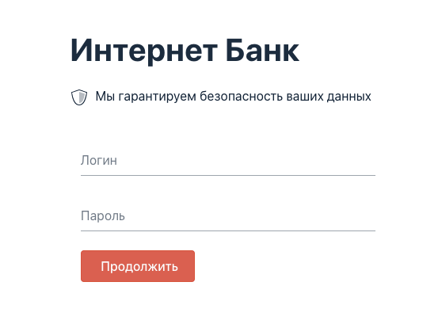
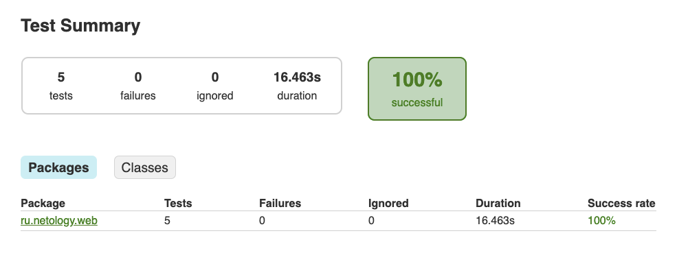

[](https://ci.appveyor.com/project/TanyTany/app-bank-test-mode)

## App_ibank_test-mode

**Autotest for checking the registration form in app test mode**

**Tools:**
* IntelliJ IDE (Gradle)
* Java 11
* JUnit
* [Rest Assured](http://rest-assured.io)
* JavaFaker for generation test data
* Selenide
* [Gson](https://github.com/google/gson)

The task is to test the login function through the web interface using Selenide.

To create a client, need to make a request like this:

```POST /api/system/users
Content-Type: application/json

{
"login": "login",
"password": "password",
"status": "active"
}

Possible values of the "status" field:
* "active"
* "blocked"

If user is successfully created, a code of 200 is returned.
When a user is re-transmitted with the same login, the user's data will be overwritten.
```

## How to use

Download the  `app-ibank.jar` in directory `artifacts` file or clone the repo and build it yourself.

Run the `.jar` file:

`java -jar app-ibank.jar -P:profile=test`

The server should start and you'll see something like:

~~~~~~~~
[DefaultDispatcher-worker-2] INFO  Application - No ktor.deployment.watch patterns specified, automatic reload is not active
[DefaultDispatcher-worker-2] INFO  Application - Responding at http://0.0.0.0:9999
~~~~~~~~

You can access the apps and pages by visiting:
- http://0.0.0.0:9999 or http://localhost:9999



## Running the tests

`./gradlew test`

## Gradle reports



